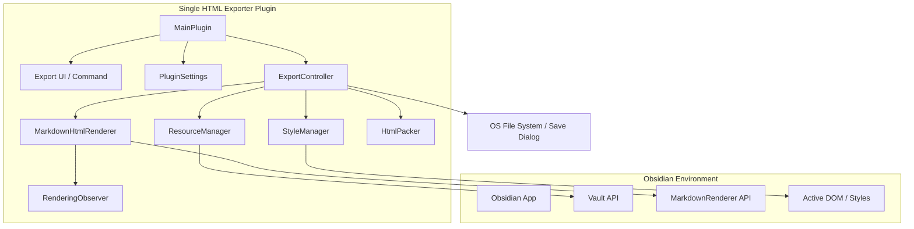
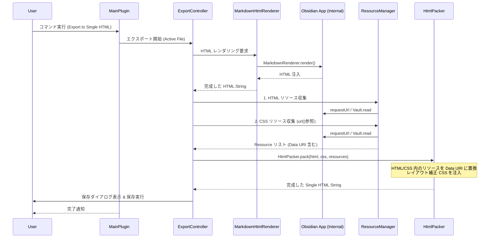

# 技術設計書 (design.md)

## 目次

- [機能一覧](#機能一覧)
- [アーキテクチャ](#アーキテクチャ)
- [インターフェース](#インターフェース)
- [コンポーネント](#コンポーネント)

## 機能一覧

| 機能カテゴリ | 機能ID | 機能名 | 概要 | 対応要件ID |
|:------------|:-------|:------|:-----|:----------|
| エクスポート操作 | F-1-1 | エクスポート実行 | コマンドパレットからエクスポートを開始する | 要件 1-1 |
| エクスポート操作 | F-1-2 | 保存先選択 | OS標準の保存ダイアログを表示し、保存パスを取得する | 要件 1-2 |
| コンテンツ変換 | F-2-1 | Markdownレンダリング | `MarkdownRenderer` を使用し HTML を生成する | 要件 2-1 |
| コンテンツ変換 | F-2-2 | スタイル抽出 | テーマとスニペットの CSS を抽出し HTML に適用する | 要件 2-2 |
| コンテンツ変換 | F-2-3 | タイトル挿入 | ノート冒頭に `<h1>` タイトルを挿入する（オプション） | 要件 2-3 |
| リソース管理 | F-3-1 | 画像・CSSリソース収集 | ローカル/外部画像およびCSS内のリソースを取得・Base64化する | 要件 3-1 |
| リソース管理 | F-3-3 | YouTubeサムネイル取得 | YouTube埋め込みからサムネイルを取得しData URI化する | 要件 3-3 |
| パッキング | F-3-2 | Single HTML 生成 | HTML/CSS内のリソースを Data URI で置換し、統合した単一HTMLを構築する | 要件 3-2 |
| ユーザー体験 | F-4-1 | 自動ブラウザ起動 | 保存後にデフォルトブラウザでファイルを開く（オプション） | 要件 4-1 |
| ユーザー体験 | F-4-2 | 別タブ画像ズーム | 画像をクリックして別タブで拡大表示可能にする（オプション） | 要件 4-2 |

## アーキテクチャ

### 設計方針

- **Native First**: Obsidian 標準の `MarkdownRenderer` を活用し、プラグインやテーマの再現性を最大化する。
- **Ninja Rendering Strategy**: Mermaid 等の描画を誘発するため、一時的に DOM に接続し画面外に飛ばして計算させる。
- **Data URI Embedding**: すべてのリソース（画像、フォント、背景画像）を Base64 文字列として埋め込むことで、完全な自己完結型 HTML を実現する。
- **Zero External Dependencies**: 置換・パッキングロジックを自前実装することで軽量性を維持。

### 全体構成図

### 全体シーケンス図

## インターフェース

### 画面

#### プラグイン設定画面
- **表示項目**: 
    - **Rendering delay (ms)**: レンダリング待機最大時間。デフォルト 500ms。
    - **Include note title**: 本文最上部にノート名を `<h1>` 挿入。
    - **Open after export**: 保存完了後にブラウザで開く。
    - **Enable image zoom (open in new tab)**: 画像をクリックして別タブで拡大表示。

#### 保存先選択ダイアログ
- **デフォルトファイル名**: `[ノート名].html`

### API (内部クラス)

#### ExportController
- **主要メソッド**:
    - `runExport(file: TFile): Promise<string>`: パイプライン全体を制御。
- **処理フロー**: 
    1. `MarkdownHtmlRenderer` による HTML 変換。
    2. `StyleManager` による CSS および body クラスの収集。
    3. `ResourceManager` による画像・フォント（HTML/CSS）の収集と Data URI 化。
    4. `HtmlPacker` によるリソースの置換と統合。

#### ResourceManager
- 概要: HTML および CSS 内のリソースを解決し、Base64 形式に変換する。
- 主要メソッド:
    - `collectResources(html: string, ...): Promise<Resource[]>`: , <audio>, <iframe> 等をスキャン。
    - `collectResourcesFromCss(css: string): Promise<Resource[]>`: url() 参照をスキャン。
- パス解決の優先順位:
    1. 外部 URL (`http://`, `https://`): Obsidian の `requestUrl` を用いてバイナリをダウンロード。
    2. YouTube 埋め込み: `<iframe>` や中間リンクから動画 ID を抽出し、サムネイルをダウンロード。
    3. 相対パス・絶対パス: Vault 内のファイルを特定しバイナリを読み込む。

#### HtmlPacker
- 概要: HTML、CSS、リソースを統合し、単一の自己完結型 HTML 文字列を構築する。
- 主要メソッド:
    - `pack(html: string, css: string, resources: Resource[], ...options): string`
- 処理概要:
    1. CSS 文字列内の URL を Data URI で置換。
    2. HTML 内の `` 属性を Data URI で置換。
    3. YouTube の `<iframe>` を、サムネイル画像、再生ボタン、リンクの構造に置換。
    4. 設定に応じて、画像を `<a>` タグでラップし別タブ表示に対応（参照: ADR-0001）。
    5. レイアウト補正 CSS を注入（スタック文脈のリセット等）。

